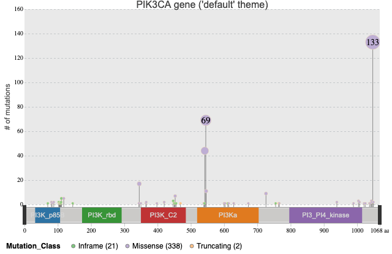
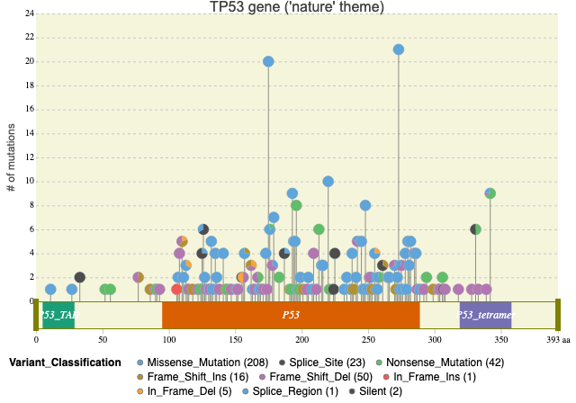
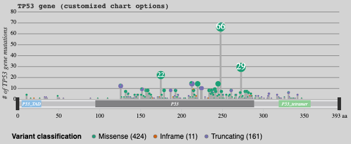
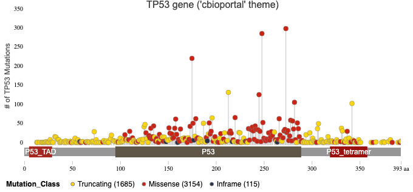
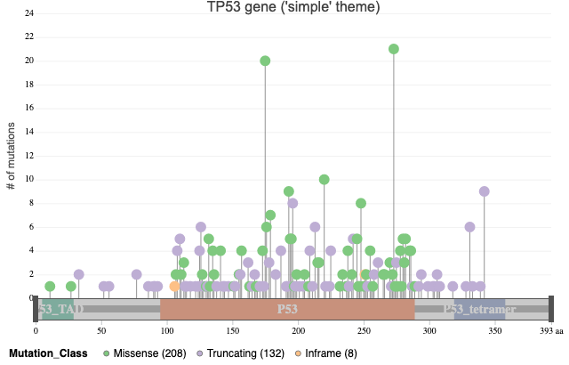
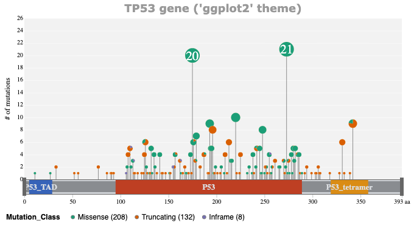

# <a name="top"></a>G3viz: an R package to interactively visualize genetic mutation data using a lollipop-diagram

  **Version: 1.0.0**<br>
  **Date: 2019-03-20**

***
### Note: this Readme with live demos are availabe at [R repository Vignette page ](https://cran.r-project.org/web/packages/g3viz/vignettes/introduction.html)
***

Easily and effectively visualizing genetic mutation data can help researchers to better understand the data and validate the findings.  `G3viz` is an R package which provides an easy-to-use lollipop-diagram tool.  It enables users to interactively visualize detailed translational effects of genetic mutations in RStudio or a web browser, without having to know any HTML5/JavaScript technologies.

The features of `g3viz` include

   - zoom in/out, pan, tooltip, and brush tools to view data details
   - interactive chart legend
   - highlight and label findings
   - built-in chart themes
   - rich chart options
   - over 35 color schemes
   - save charts in SVG or PNG format
   - built-in function to retrieve protein domain information for a given gene, and resolve gene symbol ambiguity and isoforms.
   - built-in function to map mutations types (a.k.a, variant classification; _e.g._, `Frame_Shift_Del`, `In_Frame_Ins`) to mutation classes (namely `Inframe`, `Missense`, `Truncating`, and `Other`).

## Table of contents
1. [Installation](#install)

1. [Quick Start](#quickstart)
   - [Example 1](#ex1): visualize genetic mutation data from `MAF` file
   - [Example 2](#ex2): visualize genetic mutation data from `CSV` or `TSV` file
   - [Example 3](#ex3): visualize genetic mutation data from `cBioPortal`

1. [Usage](#usage)
   - [Read in data](#readdata)
   - [Mutation Type and Class mappings](#mutation)
   - [Retrieve Pfam domain compostion](#pfamdomain)
   - [Color schemes](#schemes)
   - [Chart themes](#themes)
   - [Chart options](#options)
   - [Save charts and HTML](#save)
    
1. [Sessioninfo](#sessioninfo)


## 1. <a name="install"></a>Install `g3viz`
Install `g3viz` package from R repository
```r
# ============================================
# install package
install.packages("g3viz", repos = "http://cran.us.r-project.org")
```
or if you prefer to install the development version from github
```r
# ============================================
# Install devtools
if("devtools" %in% rownames(installed.packages()) == FALSE){ 
  install.packages("devtools")
}

# install from github
devtools::install_github("g3viz/g3viz")
```

<br/>
<div align="right">
    <b><a href="#top">↥ back to top</a></b>
</div>
<br/>

## 2. <a name="quickstart"></a>Quick Start

### <a name="ex1"></a>Example 1: Visualize genetic mutation data from `MAF` file

Mutation Annotation Format ([MAF](https://docs.gdc.cancer.gov/Data/File_Formats/MAF_Format/)) is a widely-used tab-delimited text file with annotated genetic mutation information.  Translational effect of variant alleles in `MAF` files are usually in the column of `Variant_Classification` (_i.e._, `Frame_Shift_Del`, `Split_Site`).  In this example, the somatic mutation data of the `TCGA-BRCA` study was directly downloaded from the [GDC Data Portal](https://portal.gdc.cancer.gov/projects/TCGA-BRCA).


```r
# ============================================
# System file
maf.file <- system.file("extdata", "TCGA.BRCA.varscan.somatic.maf.gz", package = "g3viz")
# ============================================
# Read in MAF file
#   In addition to read data in, the built-in "readMAF" function also
#     1. parses "Mutation_Class" information according to the "Variant_Classification" column 
#        (also named "Mutation_Class" column in some files)
#     2. parses "AA_position" (amino-acid position) according to "HGVSp_Short" information
#        (e.g., p.V122Dfs*26, p.Q136P; also name "amino_acid_change" in some files)
mutation.dat <- readMAF(maf.file)
```
<a name="default_theme"></a>
```r
# ============================================
# Chart 1
# use "default"" chart theme
# 
# Some features to check
#   1. zoom-in/out, pan, and tooltip tools in the lollipop panel
#   2. Use brush to select a reigon in the domain panel
#   3. click on lollipop pops to highlight findings
#   4. use legend to turn on/off certain mutation classes
#   5. click output buttons to save charts in SVG or PNG file
chart.options <- g3Lollipop.theme(theme.name = "default",
                                  title.text = "PIK3CA gene (default theme)")

g3Lollipop(mutation.dat,
           gene.symbol = "PIK3CA",
           plot.options = chart.options,
           output.filename = "default_theme")
#> Factor is set to Mutation_Class
#> legend title is set to Mutation_Class
```
### [Live demo](https://cran.r-project.org/web/packages/g3viz/vignettes/introduction.html#default_theme)
 


<a name="nature_theme"></a>
```r
# ============================================
# Chart 2
# Visualize data according to "Variant_Classification" information
# use "nature" chart theme
chart.options <- g3Lollipop.theme(theme.name = "nature",
                                  title.text = "TP53 gene (nature theme)")

g3Lollipop(mutation.dat,
           gene.symbol = "TP53",
           factor.col = "Variant_Classification",
           # built-in gray-style output buttons
           btn.style = "gray",
           plot.options = chart.options,
           output.filename = "nature_theme")
#> Factor is set to Variant_Classification
#> legend title is set to Variant_Classification
```

### [Live demo](https://cran.r-project.org/web/packages/g3viz/vignettes/introduction.html#nature_theme)



<br/>
<div align="right">
    <b><a href="#top">↥ back to top</a></b>
</div>
<br/>

### <a name="ex2"></a>Example 2: visualize genetic mutation data from `CSV` or `TSV` file

In this example, we load genetic mutation data from `CSV` or `TSV` files, and visualize it using some
customized [chart options](#options)

<a name="customized"></a>
```r
# ============================================
# load data
mutation.csv <- system.file("extdata", "ccle.csv", package = "g3viz")
# ============================================
# read in data
# specify "gene.symbol.col"    : column of gene symbol
#         "variant.class.col"  : column of variant class
#         "protein.change.col" : colum of protein change column
mutation.dat <- readMAF(mutation.csv,
                        gene.symbol.col = "Hugo_Symbol",
                        variant.class.col = "Variant_Classification",
                        protein.change.col = "amino_acid_change",
                        sep = ",")  # separator of csv file
# ============================================
# set up chart options
plot.options <- g3Lollipop.options(
  # chart options
  chart.width = 600,
  chart.type = "pie",
  chart.margin = list(left = 30, right = 20, top = 20, bottom = 30),
  chart.background = "#d3d3d3",
  # transition time
  transition.time = 300,
  # y-axis label
  y.axis.label = "# of TP53 gene mutations",
  axis.label.color = "#303030",
  axis.label.alignment = "end",
  axis.label.font = "italic 12px Serif",
  axis.label.dy = "-1.5em",
  # in-chart tick lines
  y.axis.line.color = "#303030",
  y.axis.line.width = 0.5,
  y.axis.line.style = "line",
  # legend
  legend = TRUE,
  legend.margin = list(left=20, right = 0, top = 10, bottom = 5),
  legend.interactive = TRUE,
  legend.title = "Variant classification",
  # lollipop track
  lollipop.track.height = 200,
  lollipop.track.background = "#d3d3d3",
  # lollipop pop
  lollipop.pop.min.size = 1,
  lollipop.pop.max.size = 8,
  # lollipop in-pop information
  lollipop.pop.info.limit = 5.5,
  lollipop.pop.info.dy = "0.24em",
  lollipop.pop.info.color = "white",
  # lollipop line
  lollipop.line.color = "#a9A9A9",
  lollipop.line.width = 3,
  # lollipop circle
  lollipop.circle.color = "#ffdead",
  lollipop.circle.width = 0.4,
  # lollipop click-on-pop highlight label
  lollipop.label.ratio = 2,
  lollipop.label.min.font.size = 12,
  # lollipop color scheme
  lollipop.color.scheme = "dark2",
  # highlight text angle
  highlight.text.angle = 60,
  # chart title
  title.color = "#303030",
  title.text = "TP53 gene (customized chart options)",
  title.font = "bold 12px monospace",
  title.alignment = "start",
  # annotation track
  anno.height = 16,
  anno.margin = list(top = 0, bottom = 0),
  anno.background = "#d3d3d3",
  # annotation track bar
  anno.bar.fill = "#a9a9a9",
  anno.bar.margin = list(top = 4, bottom = 4),
  # protein domain
  domain.color.scheme = "pie5",
  domain.margin = list(top = 2, bottom = 2),
  domain.text.color = "white",
  domain.text.font = "italic 8px Serif",
  # selection brush
  brush = TRUE,
  brush.selection.background = "#F8F8FF",
  brush.selection.opacity = 0.3,
  brush.border.color = "#a9a9a9",
  brush.border.width = 1,
  brush.handler.color = "#303030",
  # tooltip
  tooltip = TRUE,
  # zoom
  zoom = TRUE
)

g3Lollipop(mutation.dat,
           gene.symbol = "TP53",
           protein.change.col = "amino_acid_change",
           # built-in blue-style output buttons
           btn.style = "blue",
           plot.options = plot.options,
           output.filename = "customized_plot")
#> Factor is set to Mutation_Class
```


### [Live demo](https://cran.r-project.org/web/packages/g3viz/vignettes/introduction.html#customized)




<br/>
<div align="right">
    <b><a href="#top">↥ back to top</a></b>
</div>
<br/>

### <a name="ex3"></a>Example 3: visualize genetic mutation data from `cBioPortal`

[cBioPortal](http://www.cbioportal.org/) provides download for many cancer genomics data sets.  `g3viz` package also provides a convenient way to retrieve data from this portal.

In this example, we first retrieve genetic mutation data of `TP53` gene for the [msk\_impact\_2017](https://www.ncbi.nlm.nih.gov/pubmed/28481359) study, and then visualize the data using the built-in `cbioportal` theme, to miminc cBioPortal's [mutation_mapper](https://www.cbioportal.org/mutation_mapper).

<a name="cbioportal_theme"></a>
```r
# ============================================
# get genetic mutation data of "msk_impact_2017"" study from cBioPortal
mutation.dat <- getMutationsFromCbioportal("msk_impact_2017", "TP53")
#> Found study msk_impact_2017
#> Found mutation data set msk_impact_2017_mutations
#> 10945 cases in this study

# g3viz has built-in "cbioportal" theme
plot.options <- g3Lollipop.theme(theme.name = "cbioportal",
                                 title.text = "TP53 gene (cbioportal theme)",
                                 y.axis.label = "# of TP53 Mutations")

g3Lollipop(mutation.dat,
           gene.symbol = "TP53",
           btn.style = "blue",
           plot.options = plot.options,
           output.filename = "cbioportal_theme")
#> Factor is set to Mutation_Class
#> legend title is set to Mutation_Class
```

### [live demo](https://cran.r-project.org/web/packages/g3viz/vignettes/introduction.html#cbioportal_theme)




#### Note:
- Internet access is required to download data from [cBioPortal](http://www.cbioportal.org/), and it may take more than 10 seconds.  Sometimes, it may fail due to cBioPortal server problem.
- To check what studies are available on cBioPortal
```r
# ============================================
# connect to CGDS (cancer Genomics Data Server)
cgds <- cgdsr::CGDS("http://www.cbioportal.org/")
# test if connection is OK
cgdsr::test(cgds)
# get all studies
all.studies <- cgdsr::getCancerStudies(cgds)

# ============================================
# Pick a "caner_study_id" with mutation data
# query mutation data using a primary HGNC gene symbol
mutation.dat <- g3viz::getMutationsFromCbioportal("all_stjude_2016", "TP53")
```

<br/>
<div align="right">
    <b><a href="#top">↥ back to top</a></b>
</div>
<br/>

## 3. <a name="usage"></a>Usage (TLDR)

### 3.1 <a name="readdata"></a>Read in data

Genetic mutation data (_e.g._, [aggregated somatic mutations](https://docs.gdc.cancer.gov/Encyclopedia/pages/Aggregated_Somatic_Mutation/)) can be loaded in three ways in `g3viz`

1. from [MAF](https://docs.gdc.cancer.gov/Data/File_Formats/MAF_Format/) file, as shown in [Example 1](#ex1).

2. from `CSV` or `TSV` files, as shown in [Example 2](#ex2).

3. from [cBioPortal](http://www.cbioportal.org/) (internet access required), as shown in [Example 3](#ex3).

<br/>
<div align="right">
    <b><a href="#top">↥ back to top</a></b>
</div>
<br/>

### 3.2 <a name="mutation"></a>Mutation Type and Class mappings

In addtion to read in mutation data, `readMAF` or `getMutationFromCbioportal` functions also map mutation type (_a.k.a._, variant classification) to mutation class (check `g3viz::mapMutationTypeToMutationClass` function).  The default mutation type to mutation class mapping table is,

| Mutation_Type            | Mutation_Class | Short_Name               |
|--------------------------|----------------|--------------------------|
| In_Frame_Del             | Inframe        | IF del                   |
| In_Frame_Ins             | Inframe        | IF ins                   |
| Silent                   | Inframe        | Silent                   |
| Targeted_Region          | Inframe        | IF                       |
| Missense_Mutation        | Missense       | Missense                 |
| Frame_Shift              | Truncating     | FS                       |
| Frame_Shift_Del          | Truncating     | FS del                   |
| Frame_Shift_Ins          | Truncating     | FS ins                   |
| Nonsense_Mutation        | Truncating     | Nonsense                 |
| Nonstop_Mutation         | Truncating     | Nonstop                  |
| Splice_Region            | Truncating     | Splice                   |
| Splice_Site              | Truncating     | Splice                   |
| 3'Flank                  | Other          | 3'Flank                  |
| 3'UTR                    | Other          | 3'UTR                    |
| 5'Flank                  | Other          | 5'Flank                  |
| 5'UTR                    | Other          | 5'UTR                    |
| De_novo_Start_InFrame    | Other          | de_novo_start_inframe    |
| De_novo_Start_OutOfFrame | Other          | de_novo_start_outofframe |
| Fusion                   | Other          | Fusion                   |
| IGR                      | Other          | IGR                      |
| Intron                   | Other          | Intron                   |
| lincRNA                  | Other          | lincRNA                  |
| RNA                      | Other          | RNA                      |
| Start_Codon_Del          | Other          | Nonstart                 |
| Start_Codon_Ins          | Other          | start_codon_ins          |
| Start_Codon_SNP          | Other          | Nonstart                 |
| Translation_Start_Site   | Other          | TSS                      |
| Unknown                  | Other          | Unknown                  |

<br/>
<div align="right">
    <b><a href="#top">↥ back to top</a></b>
</div>
<br/>

### 3.3 <a name="pfamdomain"></a>Retrieve Pfam domain compostion
Given a [HUGO](https://www.genenames.org/) gene symbol, users can either use `hgnc2pfam` function to retrieve Pfam protein domain composition or use all-in-one `g3Lollipop` function to create lollipop-diagram.
In case that the given gene has multiple isoforms, `hgnc2pfam` returns all [UniProt](https://www.uniprot.org/) entries.
If attribute `guess` is set to `TRUE`, the Pfam domain information of the longest UniProt entry is returned.

```r
# ===============================
# TP53 has single UniProt entry
hgnc2pfam("TP53", output.format = "list")
#> $symbol
#> [1] "TP53"
#> 
#> $uniprot
#> [1] "P04637"
#> 
#> $length
#> [1] 393
#> 
#> $pfam
#>       hmm.acc     hmm.name start end   type
#> 37815 PF08563      P53_TAD     5  29  Motif
#> 37816 PF00870          P53    95 289 Domain
#> 37817 PF07710 P53_tetramer   319 358  Motif
# ===============================
# GNAS gene has multiple UniProt entries
#   `guess = TRUE`: the Pfam domain compositon of the longest 
#                   UniProt protein is returned
hgnc2pfam("GNAS", guess = TRUE)
#> GNAS maps to multiple UniProt entries: 
#>  symbol uniprot length
#>    GNAS  O95467    245
#>    GNAS  P63092    394
#>    GNAS  P84996    626
#>    GNAS  Q5JWF2   1037
#> Warning in hgnc2pfam("GNAS", guess = TRUE): Pick: Q5JWF2
#> {"symbol":"GNAS","uniprot":"Q5JWF2","length":1037,"pfam":[{"hmm.acc":"PF00503","hmm.name":"G-alpha","start":663,"end":1026,"type":"Domain"}]}
```

<br/>
<div align="right">
    <b><a href="#top">↥ back to top</a></b>
</div>
<br/>

### 3.4 <a name="schemes"></a>`g3viz` built-in color schemes

As shown in [Fig1](#color_scheme_fig1), this `g3viz` package supports with over 30 color schemes.  More demos are available at
[demo 1](https://bl.ocks.org/phoeguo/raw/2868503a074a6441b5ae6d987f150d48/),
[demo 2](https://bl.ocks.org/phoeguo/raw/de79b9ce9bda958173af9891ab7aec93/), and
[demo 3](https://bl.ocks.org/phoeguo/raw/81dffe0c7c6c8caae06f6a5f60c70d19/).

<a name="color_scheme_fig1"></a>

### [Live demo](https://bl.ocks.org/phoeguo/raw/81dffe0c7c6c8caae06f6a5f60c70d19/)


**Figure 1** *list of color schemes*

<br/>
<div align="right">
    <b><a href="#top">↥ back to top</a></b>
</div>
<br/>

### 3.5. <a name="themes"></a>`g3viz` built-in chart themes

So far, `g3viz` has 5 built-in chart schemes, namely, `default`, `nature`, `ggplot2`, `cbioportal`, and `simple`.  Examples of `g3viz` charts using [default](#default_theme), [nature](#nature_theme), and [cbioportal](#cbioportal_theme) are shown previously.

Let's take a look at the other two themes, `simple` and `ggplot2`,

```r
# ============================================
# Load system sample data
maf.file <- system.file("extdata", "TCGA.BRCA.varscan.somatic.maf.gz", package = "g3viz")
mutation.dat <- readMAF(maf.file)

# ============================================
# simple theme
chart.options <- g3Lollipop.theme(theme.name = "simple",
                                  title.text = "TP53 gene (simple theme)")

g3Lollipop(mutation.dat,
           gene.symbol = "TP53",
           plot.options = chart.options,
           btn.style = "gray",
           output.filename = "simple_theme")
#> Factor is set to Mutation_Class
#> legend title is set to Mutation_Class
```

### [live demo](https://cran.r-project.org/web/packages/g3viz/vignettes/introduction.html#simple_theme)



```r
# ============================================
# ggplot2 theme
chart.options <- g3Lollipop.theme(theme.name = "ggplot2",
                                  title.text = "TP53 gene (ggplot2 theme)")

g3Lollipop(mutation.dat,
           gene.symbol = "TP53",
           plot.options = chart.options,
           btn.style = "gray",
           output.filename = "ggplot2_theme")
#> Factor is set to Mutation_Class
#> legend title is set to Mutation_Class
```

### [Live demo](https://cran.r-project.org/web/packages/g3viz/vignettes/introduction.html#ggplot2_theme)




<br/>
<div align="right">
    <b><a href="#top">↥ back to top</a></b>
</div>
<br/>

### 3.6.  <a name="options"></a>Lollipop-diagram chart options

Chart options can be specified using `g3Lollipop.options()` function (see [example 2](#ex2)).
Here is the full list of chart options,

Option                       | Description
-----------------------------|---------------------------------------
chart.width                  | chart width in px.  Default `800`.  Note: `chart.height` is calculated by adding `lollipop.track.height`, `anno.height`, and the height of `legend`.
chart.type                   | pop type, _pie_ or _circle_.  Default `pie`.
chart.margin                 | specify chart margin in _list_ format.  Default `list(left = 40, right = 20, top = 15, bottom = 25)`.
chart.background             | chart background.  Default `transparent`.
transition.time              | chart animation transition time in millisecond.  Default `600`.
y.axis.label                 | Y-axis label text.  Default `mutations`.
axis.label.font              | css font style shorthand (font-style font-variant font-weight font-size/line-height font-family).  Default `normal 12px Arial`.
axis.label.color             | axis label text color.  Default `#4f4f4f`.
axis.label.alignment         | axis label text alignment (start/end/middle). Default `middle`
axis.label.dy                | text adjustment of axis label text.  Default `-2em`.
y.axis.line.color	           | color of y-axis in-chart lines (ticks). Default `#c4c8ca`.
y.axis.line.style	           | style of y-axis in-chart lines (ticks), `dash` or `line`. Default `dash`.
y.axis.line.width	           | width of y-axis in-chart lines (ticks). Default `1`.
legend.margin                | legend margin in _list_ format. Default `list(left = 10, right = 0, top = 5, bottom = 5)`.
legend.interactive           | legend interactive mode. Default `TRUE`.
legend.title                 | legend title. If `NA`, use factor name as `factor.col`. Default is `NA`.
lollipop.track.height        | height of lollipop track. Default `420`.
lollipop.track.background    | background of lollipop track. Default `rgb(244,244,244)`.
lollipop.pop.min.size        | lollipop pop minimal size in px. Default `2`.
lollipop.pop.max.size        | lollipop pop maximal size in px. Default `12`.
lollipop.pop.info.limit      | threshold of lollipop pop size to show count information in middle of pop. Default `8`.
lollipop.pop.info.color      | lollipop pop information text color. Default `#EEE`.
lollipop.pop.info.dy         | y-axis direction text adjustment of lollipop pop information. Default `-0.35em`.
lollipop.line.color          | lollipop line color. Default `rgb(42,42,42)`.
lollipop.line.width          | lollipop line width. Default `0.5`.
lollipop.circle.color        | lollipop circle border color. Default `wheat`.
lollipop.circle.width        | lollipop circle border width. Default `0.5`.
lollipop.label.ratio         | lollipop click-out label font size to circle size ratio. Default `1.4`.
lollipop.label.min.font.size | lollipop click-out label minimal font size. Default `10`.
lollipop.color.scheme        | color scheme to fill lollipop pops. Default `accent`. Check [demo 1](https://bl.ocks.org/phoeguo/raw/2868503a074a6441b5ae6d987f150d48/), [demo 2](https://bl.ocks.org/phoeguo/raw/de79b9ce9bda958173af9891ab7aec93/), and [demo 3](https://bl.ocks.org/phoeguo/raw/81dffe0c7c6c8caae06f6a5f60c70d19/).
title.text                   | title of chart. Default "".
title.font                   | font of chart title. Default `normal 16px Arial`.
title.color                  | color of chart title. Default `#424242`.
title.alignment              | text alignment of chart title (start/middle/end). Default `middle`.
title.dy                     | text adjustment of chart title. Default `0.35em`.
anno.height                  | height of protein structure annotation track. Default `30`.
anno.margin                  | margin of protein structure annotation track. Default `list(top = 4, bottom = 0)`.
anno.background              | background of protein structure annotation track. Default `transparent`.
anno.bar.fill                | background of protein bar in protein structure annotation track. Default `#E5E3E1`.
anno.bar.margin              | margin of protein bar in protein structure annotation track. Default `list(top = 2, bottom = 2)`.
domain.color.scheme          | color scheme of protein domains. Default `category10`.
domain.margin                | margin of protein domains. Default `list(top = 0, bottom = 0)`.
domain.text.font             | domain label text font in shorthand format. Default `normal 11px Arial`.
domain.text.color            | domain label text color. Default `#F2F2F2`.
brush	                       | if show brush. Default `TRUE`.
brush.selection.background	 | background color of selection brush. Default `#666`.
brush.selection.opacity	     | background opacity of selection brush. Default `0.2`.
brush.border.color	         | border color of selection brush. Default `#969696`.
brush.handler.color	         | color of left and right handlers of selection brush. Default `#333`.
brush.border.width	         | border width of selection brush. Default `1`.
legend                       | if show legend. Default `TRUE`.
tooltip                      | if show tooltip. Default `TRUE`.
zoom                         | if enable zoom feature. Default `TRUE`.


<br/>
<div align="right">
    <b><a href="#top">↥ back to top</a></b>
</div>
<br/>

### 3.7  <a name="save"></a>Save charts and HTML

`g3Lollipop` function provides two buttons over the lollipop-diagram, enabling users to save chart in SVG or PNG file.
If you want to save chart in HTML file, you can use `htmlwidgets::saveWidget` function.

```r
chart <- g3Lollipop(mutation.dat,
                    gene.symbol = "TP53",
                    protein.change.col = "amino_acid_change",
                    plot.options = plot.options)
htmlwidgets::saveWidget(chart, "g3lollipop_chart.html")
```

<br/>
<div align="right">
    <b><a href="#top">↥ back to top</a></b>
</div>
<br/>

## 4. <a name="sessioninfo"></a>Session Info

```r
sessionInfo()
#> R version 3.5.1 (2018-07-02)
#> Platform: x86_64-apple-darwin15.6.0 (64-bit)
#> Running under: macOS  10.14.3
#> 
#> Matrix products: default
#> BLAS: /Library/Frameworks/R.framework/Versions/3.5/Resources/lib/libRblas.0.dylib
#> LAPACK: /Library/Frameworks/R.framework/Versions/3.5/Resources/lib/libRlapack.dylib
#> 
#> locale:
#> [1] C/en_US.UTF-8/en_US.UTF-8/C/en_US.UTF-8/en_US.UTF-8
#> 
#> attached base packages:
#> [1] stats     graphics  grDevices utils     datasets  methods   base     
#> 
#> other attached packages:
#> [1] g3viz_1.0.0
#> 
#> loaded via a namespace (and not attached):
#>  [1] Rcpp_1.0.1        digest_0.6.18     R.methodsS3_1.7.1
#>  [4] jsonlite_1.6      magrittr_1.5      evaluate_0.13    
#>  [7] cgdsr_1.2.10      stringi_1.4.3     R.oo_1.22.0      
#> [10] rmarkdown_1.12    tools_3.5.1       stringr_1.4.0    
#> [13] htmlwidgets_1.3   xfun_0.5          yaml_2.2.0       
#> [16] compiler_3.5.1    htmltools_0.3.6   knitr_1.22
```

<br/>
<div align="right">
    <b><a href="#top">↥ back to top</a></b>
</div>
<br/>

