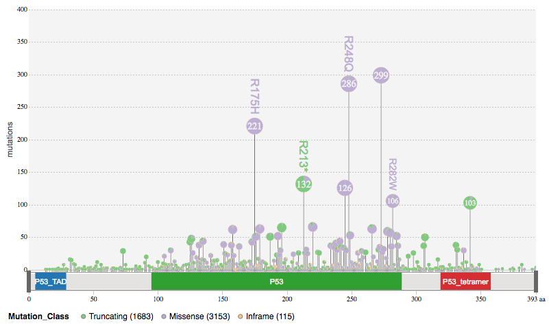
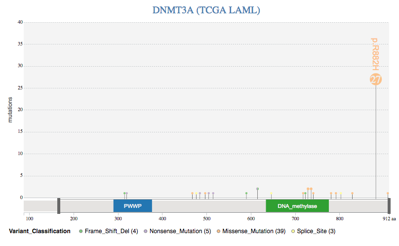

# G3viz: interactively visualizing cancer genomic data

G3viz is a R package for Interactively visualizing cancer genomic data in web browser, without HTML5/Javascript knowledge. 

## Introduction

Effectively visualize cancer genomic data can help researchers to understand the complicated genomic data. The aim of this `g3viz` _R_ library is to provide a suite of web-based visualization tools that enables researchers to easily generate and interactively visualize their genomic data using a web browser, without knwoing additional web technologies (HTML5, Javascript, etc).

## Installation
```r
# Install devtools
install.package("devtools")

# load devtools
library(devtools)

# install g3viz from github
devtools::install_github("g3js/g3viz")

```

## Examples

#### Example 1.

Retrieve genomic mutation data of _msk\_impact\_2017_ study for the gene _TP53_ from [cBioPortal](http://www.cbioportal.org/).

```r
library(g3viz)
# msk_impact_2017: https://www.ncbi.nlm.nih.gov/pubmed/28481359
mutation.dat <- getMutationsFromCbioportal("msk_impact_2017", "TP53")

# lollipop diagram with default options
g3Lollipop(mutation.dat, gene.symbol = "TP53", variant.class.col = "Mutation_Type")
```
Lollipop plot:




#### Example 2.

Read data from [MAF](https://docs.gdc.cancer.gov/Data/File_Formats/MAF_Format/) file, classified the mutation data by detailed _Variant\_Classification_ information (i.e., _Frame\_Shift\_Del_, _Split\_Site_). 

```r
library(g3viz)

# load and read MAF file
maf.file <- system.file("extdata", "tcga_laml.maf.gz", package = "g3viz")
mutation.dat <- readMAF(input.maf)

# lollipop diagram, add title
g3Lollipop(mutation.dat, gene.symbol = "DNMT3A", 
           variant.class.col = "Variant_Classification", factor.col = "Variant_Classification",
           chart.margin = list(left = 40, right = 20, top = 40, bottom = 25),
           title.text = "DNMT3A (TCGA LAML)", title.font = "normal 20px Sans",
           title.color = "steelblue", title.alignment = "middle", title.dy = "0.1em")
```
Lollipop plot:



