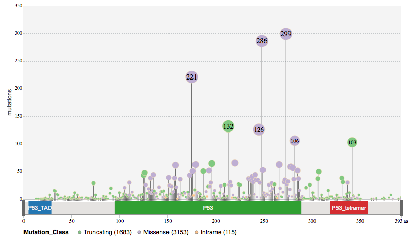

# <a name="top"></a>G3Viz: interactively visualize genomic data

Easily and effectively visualizing genomic data can help researchers to better understand their data. 
G3Viz is an [R](https://www.r-project.org/) package, which aims to provide a suite of easy-to-use visualization tools to enable users to interactively visualize genomic data in a web browser, without having to know any HTML5/JavaScript technologies. 

## Content
* [Installation](#installation)
* [Quick Start](#quickstart)
  * [Example 1](#ex1): visualize mutation data from [cBioPortal](http://www.cbioportal.org/)
  * [Example 2](#ex2): visualize mutation data in [MAF](https://docs.gdc.cancer.gov/Data/File_Formats/MAF_Format/) file
  * [Example 3](#ex3): visualize mutation data in _CSV_ or _TSV_ formatted file
* [Usage](#usage)
  1. [Read Data](#readdata)
  2. [Set chart options](#options)
  3. [Visualize genomic mutation data via a lollipop diagram in a web browser](#view)


## <a name="install"></a>Installation
```r
# Install devtools
if("devtools" %in% rownames(installed.packages()) == FALSE){ 
  install.packages("devtools")
}

# install g3viz from github
devtools::install_github("g3js/lollipopR")

```

<br/>
<div align="right">
    <b><a href="#top">↥ back to top</a></b>
</div>
<br/>

## <a name="quickstart"><a>Quick Start

### <a name="ex1"></a>Example 1: visualize mutation data from [cBioPortal](http://www.cbioportal.org/)

Retrieve genomic mutation data of [msk\_impact\_2017](https://www.ncbi.nlm.nih.gov/pubmed/28481359) study for the gene _TP53_ from [cBioPortal](http://www.cbioportal.org/).

```r
library(g3viz)

# get mutation data of msk_impact_2017 study from cBioPortal
mutation.dat <- getMutationsFromCbioportal("msk_impact_2017", "TP53")

# lollipop diagram with default options
g3Lollipop(mutation.dat, gene.symbol = "TP53")
```
>
> [Live example](https://bl.ocks.org/phoeguo/raw/583a12e04c6b9d7ca1825cdbdc62f531/)
>
> 
>

<br/>
<div align="right">
    <b><a href="#top">↥ back to top</a></b>
</div>
<br/>

### <a name="ex2"></a>Example 2: visualize mutation data in [MAF](https://docs.gdc.cancer.gov/Data/File_Formats/MAF_Format/) file

Load data from [MAF](https://docs.gdc.cancer.gov/Data/File_Formats/MAF_Format/) file, classified the mutation data by detailed _Variant\_Classification_ information (i.e., _Frame\_Shift\_Del_, _Split\_Site_).  In this example, the MAF data was downloaded directly from [TCGA-BRCA](https://portal.gdc.cancer.gov/projects/TCGA-BRCA) project GDC Data Portal.

```r
library(g3viz)

# load and read MAF file
maf.file <- system.file("extdata", "TCGA.BRCA.varscan.somatic.maf.gz", package = "g3viz")
mutation.dat <- readMAF(maf.file)

# lollipop diagram, classified by "Variant_Classification"
# plot options: add chart title
plot.options <- g3Lollipop.options(chart.margin = list(left = 40, right = 40, top = 30, bottom = 25),
                                   title.text = "PIK3CA (TCGA-BRCA)", title.font = "normal 20px Sans",
                                   title.color = "steelblue", title.alignment = "middle", title.dy = "0.3em")
g3Lollipop(mutation.dat,
           gene.symbol = "PIK3CA",
           factor.col = "Variant_Classification",
           plot.options = plot.options)
```
>
> [Live example](https://bl.ocks.org/phoeguo/raw/302a0ff5729f6aa773c33d4bfd3061c4/)
>
> 
>

<br/>
<div align="right">
    <b><a href="#top">↥ back to top</a></b>
</div>
<br/>

### <a name="ex3"></a>Example 3: visualize mutation data in _CSV_ or _TSV_ formatted file

Load user-defined file in _CSV_ or _TSV_ format.

```r
library(g3viz)

# load and read data
mutation.csv <- system.file("extdata", "ccle.csv", package = "g3viz")

# customized column names
mutation.dat <- readMAF(mutation.csv,
                        gene.symbol.col = "Hugo_Symbol",
                        variant.class.col = "Variant_Classification",
                        protein.change.col = "amino_acid_change",
                        sep = ",")  # separator of csv file

# plot options: try to mimic MutationMapper (http://www.cbioportal.org/mutation_mapper.jsp)
#               change color scheme of mutation track and domain annotation track
plot.options <- g3Lollipop.options(chart.width = 1600,
                                   chart.type = "circle",
                                   lollipop.track.background = "transparent",
                                   lollipop.pop.max.size = 4,
                                   lollipop.pop.min.size = 4,
                                   lollipop.pop.info.limit = 4.1, # same pop size
                                   y.axis.label = "# Mutations",
                                   lollipop.line.color = "grey",
                                   lollipop.line.width = 0.5,
                                   lollipop.circle.color = "black",
                                   lollipop.circle.width = 0.5,
                                   lollipop.color.scheme = "bottlerocket2",
                                   anno.bar.margin = list(top = 5, bottom = 5),
                                   domain.color.scheme = "darjeeling2",
                                   domain.text.font = "normal 8px Arial",
                                   domain.text.color = "white")

g3Lollipop(mutation.dat,
           gene.symbol = "APC",
           protein.change.col = "amino_acid_change",
           plot.options = plot.options)
```
>
> [Live example](https://bl.ocks.org/phoeguo/raw/60f804c6683de30650e36ee912304754/)
>
> 
>

<br/>
<div align="right">
    <b><a href="#top">↥ back to top</a></b>
</div>
<br/>

## <a name="usage"></a>Usage

1. <a name="readdata"></a>Read data

Genomic mutation data (_e.g._, [aggregated somatic mutations](https://docs.gdc.cancer.gov/Encyclopedia/pages/Aggregated_Somatic_Mutation/)) can be loaded in three ways

- from [MAF](https://docs.gdc.cancer.gov/Data/File_Formats/MAF_Format/) file, for example,

```r
maf.file <- system.file("extdata", "TCGA.BRCA.varscan.somatic.maf.gz", package = "g3viz")
mutation.dat <- readMAF(maf.file)
```

- directly from [cBioPortal]<a href="https://docs.gdc.cancer.gov/Data/File_Formats/MAF_Format/">MAF</a> (internet access required), for example,

```r
# get mutation data of msk_impact_2017 study from cBioPortal
mutation.dat <- getMutationsFromCbioportal("msk_impact_2017", "TP53")
```

- from _CSV_ or _TSV_ formatted file

```r
# load and read data
mutation.csv <- system.file("extdata", "ccle.csv", package = "g3viz")

mutation.dat <- readMAF(mutation.csv,
                        gene.symbol.col = "Hugo_Symbol",
                        variant.class.col = "Variant_Classification",
                        protein.change.col = "amino_acid_change",
                        sep = ",")  # separator of csv file
```

<br/>
<div align="right">
    <b><a href="#top">↥ back to top</a></b>
</div>
<br/>

2. <a name="options"></a>Set chart options

Chart options can be specified using `g3Lollipop.options()` function (_e.g._, `g3Lollipop.options(chart.type = "circle", lollipop.track.background = "transparent")`.  Use `?g3viz::g3Lollipop.options` to check these options.
These options are listed in the following table. 

Option name             | Description
----------------------- | --------------------------------------
chart.width             | chart width in px.  Default `800`.
chart.type              | pop type, _pie_ or _circle_.  Default `pie`.
chart.margin            | specify chart margin in _list_ format.  Default `list(left = 40, right = 20, top = 15, bottom = 25)`.
chart.background        | chart background.  Default `transparent`.
transition.time         | chart animation transition time in millisecond.  Default `600`.
y.axis.label            | Y-axis label text.  Default `mutations`.
axis.label.font         | css font style shorthand (font-style font-variant font-weight font-size/line-height font-family).  Default `normal 12px Arial`.
axis.label.color        | axis label text color.  Default `#4f4f4f`.
axis.label.alignment    | axis label text alignment (start/end/middle). Default `middle`
axis.label.dy           | text adjustment of axis label text.  Default `-2em`.
legend.margin           | legend margin in _list_ format. Default `list(left = 10, right = 0, top = 5, bottom = 5)`.
legend.interactive      | legend interactive mode. Default `TRUE`.
legend.title            | legend title. If `NA`, use factor name as `factor.col`. Default is `NA`.
lollipop.track.height   | height of lollipop track. Default `420`.
lollipop.track.background  | background of lollipop track. Default `rgb(244,244,244)`.
lollipop.pop.min.size  | lollipop pop minimal size in px. Default `2`.
lollipop.pop.max.size | lollipop pop maximal size in px. Default `12`.
lollipop.pop.info.limit | threshold of lollipop pop size to show count information in middle of pop. Default `8`.
lollipop.pop.info.color | lollipop pop information text color. Default `#EEE`.
lollipop.line.color | lollipop line color. Default `rgb(42,42,42)`.
lollipop.line.width | lollipop line width. Default `0.5`.
lollipop.circle.color | lollipop circle border color. Default `wheat`.
lollipop.circle.width | lollipop circle border width. Default `0.5`.
lollipop.label.ratio | lollipop click-out label font size to circle size ratio. Default `1.4`.
lollipop.label.min.font.size | lollipop click-out label minimal font size. Default `10`.
lollipop.color.scheme | color scheme to fill lollipop pops. Default `accent`. [Live example](https://bl.ocks.org/phoeguo/raw/2868503a074a6441b5ae6d987f150d48/)
title.text | title of chart. Default "".
title.font | font of chart title. Default `normal 16px Arial`.
title.color | color of chart title. Default `#424242`.
title.alignment | text alignment of chart title (start/middle/end). Default `middle`.
title.dy | text adjustment of chart title. Default `0.35em`.
anno.height | height of protein structure annotation track. Default `30`.
anno.margin | margin of protein structure annotation track. Default `list(top = 4, bottom = 0)`.
anno.background | background of protein structure annotation track. Default `transparent`.
anno.bar.fill | background of protein bar in protein structure annotation track. Default `#E5E3E1`.
anno.bar.margin | margin of protein bar in protein structure annotation track. Default `list(top = 2, bottom = 2)`.
domain.color.scheme | color scheme of protein domains. Default `category10`.
domain.margin | margin of protein domains. Default `list(top = 0, bottom = 0)`.
domain.text.font | domain label text font in shorthand format. Default `normal 11px Arial`.
domain.text.color | domain label text color. Default `#F2F2F2`.
legend | if show legend. Default `TRUE`.
tooltip | if show tooltip. Default `TRUE`.
brush | if show brush. Default `TRUE`.
zoom | if enable zoom feature. Default `TRUE`.

<br/>
<div align="right">
    <b><a href="#top">↥ back to top</a></b>
</div>
<br/>

3. <a name="view"></a>Visualize genomic mutation data via a lollipop diagram in a web browser

Call `g3Lollipop` function to visualize genomic mutation data in a web browser.  For example

```r
g3Lollipop(mutation.dat,
           gene.symbol = "APC",
           gene.symbol.col = gene.symbol.colname,
           protein.change.col = protein.change.colname,
           plot.options = plot.options)
```

<br/>
<div align="right">
    <b><a href="#top">↥ back to top</a></b>
</div>
<br/>
