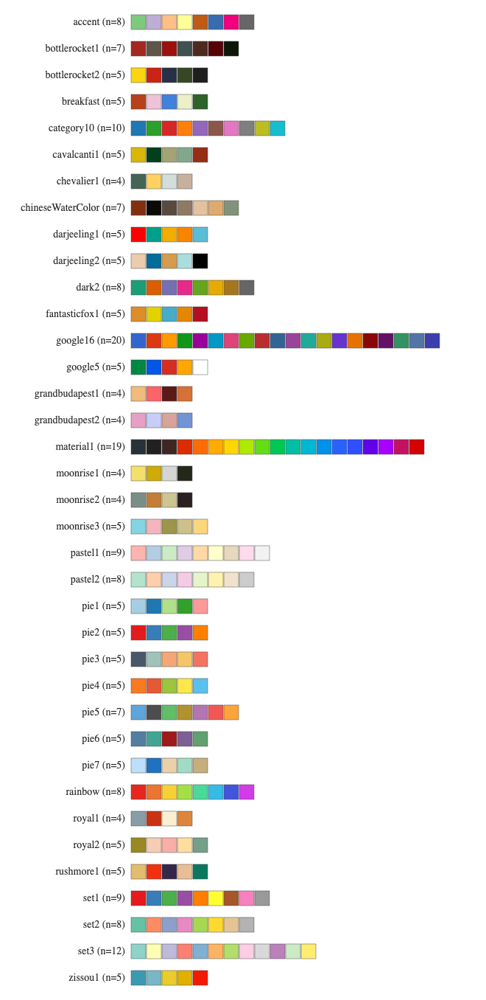

```{r, message=FALSE, include = FALSE}
# install package
library(g3viz)
library(knitr)
library(kableExtra)
```


```{r setup, include = FALSE}
knitr::opts_chunk$set(
	echo = TRUE,
	collapse = TRUE,
	comment = "#>"
)
```


# <a name="introduction"></a>Introduction

Intuitively and effectively visualizing genetic mutation data can help researchers to better understand genomic data and validate findings.  `G3viz` is an R package which provides an easy-to-use lollipop-diagram tool.  It enables users to interactively visualize detailed translational effect of genetic mutations in RStudio or a web browser, without having to know any HTML5/JavaScript technologies.

The features of `g3viz` include

- Interactive (zoom & pan, tooltip, brush selection tool, and interactive legend)
- Highlight and label positional mutations
- 8 ready-to-use [chart themes](#themes)
- Highly customizable with over 50 [chart options](#options) and over 35 [color schemes](#schemes)
- Save charts in PNG or high-quality SVG format
- Built-in function to retrieve [protein domain information](#pfam) and resolve gene isoforms
- Built-in function to [map genetic mutation type (a.k.a, variant classification) to mutation class](#mutation)

[↥ back to top](#top)


# <a name="install"></a>Install `g3viz`
Install from R repository
```r
# install package
install.packages("g3viz", repos = "http://cran.us.r-project.org")
```
or install development version from github
```r
# Check if "devtools" installed
if("devtools" %in% rownames(installed.packages()) == FALSE){ 
  install.packages("devtools")
}

# install from github
devtools::install_github("g3viz/g3viz")
```

[↥ back to top](#top)


# <a name="quickstart"></a>Quick Start

```{r include = TRUE, message=FALSE, eval=FALSE}
# load g3viz package
library(g3viz)
```

## <a name="ex1"></a>Example 1: Visualize genetic mutation data from `MAF` file

Mutation Annotation Format ([MAF](https://docs.gdc.cancer.gov/Data/File_Formats/MAF_Format/)) is a commonly-used tab-delimited text file for storing aggregated mutation information.  It could be generated from [VCF](https://docs.gdc.cancer.gov/Data/File_Formats/VCF_Format/) file using tools like [vcf2maf](https://github.com/mskcc/vcf2maf).  Translational effect of variant alleles in `MAF` files are usually in the column named `Variant_Classification` or `Mutation_Type` (_i.e._, `Frame_Shift_Del`, `Split_Site`).  In this example, the somatic mutation data of the *TCGA-BRCA* study was originally downloaded from the [GDC Data Portal](https://portal.gdc.cancer.gov/projects/TCGA-BRCA).


```{r include = TRUE}
# System file
maf.file <- system.file("extdata", "TCGA.BRCA.varscan.somatic.maf.gz", package = "g3viz")

# ============================================
# Read in MAF file
#   In addition to read data in, g3viz::readMAF function does
#     1. parse "Mutation_Class" information from the "Variant_Classification"
#        column (also named "Mutation_Type" in some files)
#     2. parse "AA_position" (amino-acid position) from the "HGVSp_Short" column 
#        (also named "amino_acid_change" in some files) (e.g., p.Q136P)
# ============================================
mutation.dat <- readMAF(maf.file)
```
<a name="default_theme"></a>
```{r include = TRUE}
# ============================================
# Chart 1
# "default" chart theme
# ============================================
chart.options <- g3Lollipop.theme(theme.name = "default",
                                  title.text = "PIK3CA gene (default theme)")

g3Lollipop(mutation.dat,
           gene.symbol = "PIK3CA",
           plot.options = chart.options,
           output.filename = "default_theme")
```
<a name="nature_theme"></a>

[↥ back to top](#top)


## <a name="ex2"></a>Example 2: visualize genetic mutation data from `CSV` or `TSV` file

In this example, we read genetic mutation data from `CSV` or `TSV` files, and visualize it using some
customized [chart options](#options).  Note this is equivalent to *dark* chart theme.

<a name="customized"></a>
```{r include=TRUE}
# load data
mutation.csv <- system.file("extdata", "ccle.csv", package = "g3viz")

# ============================================
# read in data
#   "gene.symbol.col"    : column of gene symbol
#   "variant.class.col"  : column of variant class
#   "protein.change.col" : colum of protein change column
# ============================================
mutation.dat <- readMAF(mutation.csv,
                        gene.symbol.col = "Hugo_Symbol",
                        variant.class.col = "Variant_Classification",
                        protein.change.col = "amino_acid_change",
                        sep = ",")  # column-separator of csv file

# set up chart options
plot.options <- g3Lollipop.options(
  # Chart settings
  chart.width = 600,
  chart.type = "pie",
  chart.margin = list(left = 30, right = 20, top = 20, bottom = 30),
  chart.background = "#d3d3d3",
  transition.time = 300,
  # Lollipop track settings
  lollipop.track.height = 200,
  lollipop.track.background = "#d3d3d3",
  lollipop.pop.min.size = 1,
  lollipop.pop.max.size = 8,
  lollipop.pop.info.limit = 5.5,
  lollipop.pop.info.dy = "0.24em",
  lollipop.pop.info.color = "white",
  lollipop.line.color = "#a9A9A9",
  lollipop.line.width = 3,
  lollipop.circle.color = "#ffdead",
  lollipop.circle.width = 0.4,
  lollipop.label.ratio = 2,
  lollipop.label.min.font.size = 12,
  lollipop.color.scheme = "dark2",
  highlight.text.angle = 60,
  # Domain annotation track settings
  anno.height = 16,
  anno.margin = list(top = 0, bottom = 0),
  anno.background = "#d3d3d3",
  anno.bar.fill = "#a9a9a9",
  anno.bar.margin = list(top = 4, bottom = 4),
  domain.color.scheme = "pie5",
  domain.margin = list(top = 2, bottom = 2),
  domain.text.color = "white",
  domain.text.font = "italic 8px Serif",
  # Y-axis label
  y.axis.label = "# of TP53 gene mutations",
  axis.label.color = "#303030",
  axis.label.alignment = "end",
  axis.label.font = "italic 12px Serif",
  axis.label.dy = "-1.5em",
  y.axis.line.color = "#303030",
  y.axis.line.width = 0.5,
  y.axis.line.style = "line",
  y.max.range.ratio = 1.1,
  # Chart title settings
  title.color = "#303030",
  title.text = "TP53 gene (customized chart options)",
  title.font = "bold 12px monospace",
  title.alignment = "start",
  # Chart legend settings
  legend = TRUE,
  legend.margin = list(left=20, right = 0, top = 10, bottom = 5),
  legend.interactive = TRUE,
  legend.title = "Variant classification",
  # Brush selection tool
  brush = TRUE,
  brush.selection.background = "#F8F8FF",
  brush.selection.opacity = 0.3,
  brush.border.color = "#a9a9a9",
  brush.border.width = 1,
  brush.handler.color = "#303030",
  # tooltip and zoom
  tooltip = TRUE,
  zoom = TRUE
)

g3Lollipop(mutation.dat,
           gene.symbol = "TP53",
           protein.change.col = "amino_acid_change",
           btn.style = "blue", # blue-style chart download buttons
           plot.options = plot.options,
           output.filename = "customized_plot")
```

[↥ back to top](#top)


## <a name="ex3"></a>Example 3: visualize genetic mutation data from `cBioPortal`

[cBioPortal](http://www.cbioportal.org/) provides download for many cancer genomics data sets.
`g3viz` has a convenient way to retrieve data directly from this portal.

In this example, we first retrieve genetic mutation data of `TP53` gene for the [msk\_impact\_2017](https://pubmed.ncbi.nlm.nih.gov/28481359/) study,
and then visualize the data using the built-in `cbioportal` theme, to miminc cBioPortal's [mutation_mapper](https://www.cbioportal.org/mutation_mapper).

<a name="cbioportal_theme"></a>
```{r include=TRUE}
# Retrieve mutation data of "msk_impact_2017" from cBioPortal
mutation.dat <- getMutationsFromCbioportal("msk_impact_2017", "TP53")

# "cbioportal" chart theme
plot.options <- g3Lollipop.theme(theme.name = "cbioportal",
                                 title.text = "TP53 gene (cbioportal theme)",
                                 y.axis.label = "# of TP53 Mutations")

g3Lollipop(mutation.dat,
           gene.symbol = "TP53",
           btn.style = "gray", # gray-style chart download buttons
           plot.options = plot.options,
           output.filename = "cbioportal_theme")
```

#### Note:
- Internet access is required to download data from [cBioPortal](http://www.cbioportal.org/).  This may take more than 10 seconds, or sometimes it may fail.
- To check what studies are available on cBioPortal
```r

# list all studies of cBioPortal
all.studies <- getStudies(cbio, buildReport = FALSE)

# Pick up a cancer study (studyId) with mutation data (gene symbol)
mutation.dat <- g3viz::getMutationsFromCbioportal("all_stjude_2016", "TP53")
```

[↥ back to top](#top)


# <a name="usage"></a>Usage

## <a name="readdata"></a>Read data

In `g3viz`, annotated mutation data can be loaded in three ways

1. from [MAF](https://docs.gdc.cancer.gov/Data/File_Formats/MAF_Format/) file, as in [Example 1](#ex1).

2. from `CSV` or `TSV` files, as in [Example 2](#ex2).

3. from [cBioPortal](http://www.cbioportal.org/) (internet access required), as in [Example 3](#ex3).

[↥ back to top](#top)


## <a name="mutation"></a>Map mutation type to mutation class

In addtion to reading mutation data, `readMAF` or `getMutationFromCbioportal` functions also map mutation type to mutation class and generate a `Mutation_Class` column by default.  Mutation type is usually in the column of `Variant_Classification` or `Mutation_Type`.  The default mapping table is,

```{r, include=TRUE, echo=FALSE}
mutation.mapping.df = read.table("tables/mutation_mapping.tsv", sep="\t", header=TRUE, quote="")
kable(mutation.mapping.df) %>% 
  kable_styling(bootstrap_options = c("striped", "hover", "bordered", "condensed"), full_width = TRUE) %>%
  pack_rows("Inframe", 1, 4)  %>%
  pack_rows("Missense", 5, 5) %>%
  pack_rows("Truncating", 6, 12)  %>%
  pack_rows("Other", 13, 28)
```


[↥ back to top](#top)


## <a name="pfam"></a>Retrieve Pfam domain inforamtion
Given a [HUGO](https://www.genenames.org/) gene symbol, users can either use `hgnc2pfam` function to retrieve [Pfam](https://pfam.xfam.org/) protein domain information first or use all-in-one `g3Lollipop` function to directly create lollipop-diagram.  In case that the given gene has multiple isoforms, `hgnc2pfam` returns all [UniProt](https://www.uniprot.org/) entries, and users can specify one using the corresponding `UniProt` entry.  If attribute `guess` is `TRUE`, the Pfam domain information of the longest UniProt entry is returned.

```{r, include = TRUE}
# Example 1: TP53 has single UniProt entry
hgnc2pfam("TP53", output.format = "list")

# Example 2: GNAS has multiple UniProt entries
#   `guess = TRUE`: the Pfam domain information of the longest 
#                   UniProt protein is returned
hgnc2pfam("GNAS", guess = TRUE)
```

[↥ back to top](#top)


## <a name="themes"></a> Chart themes

The `g3viz` package contains 8 ready-to-use chart schemes: *default*, *blue*, *simple*, *cbioportal*, *nature*, *nature2*, *ggplot2*, and *dark*.  Check [this tutorial](chart_themes.html) for examples and usage.

[↥ back to top](#top)


## <a name="schemes"></a> Color schemes

[Figure 1](#color_scheme_fig1) demonstrates all color schemes that `g3viz` supports for lollipop-pops and Pfam domains.  More demos are available at [demo 1](https://bl.ocks.org/phoeguo/raw/2868503a074a6441b5ae6d987f150d48/), [demo 2](https://bl.ocks.org/phoeguo/raw/de79b9ce9bda958173af9891ab7aec93/), and [demo 3](https://bl.ocks.org/phoeguo/raw/81dffe0c7c6c8caae06f6a5f60c70d19/).

<a name="color_scheme_fig1"></a>
```{r, chunk-label, out.width = "620px", fig.align='center', fig.cap='**Figure 1.** List of color schemes supported by `g3viz`', echo = FALSE}

```

[↥ back to top](#top)


## <a name="options"></a> Chart options

Chart options can be specified using `g3Lollipop.options()` function (see [example 2](#ex2)).
Here is the full list of chart options,

```{r, include=TRUE, echo=FALSE}
chart.options.df = read.table("tables/chart_options.tsv", sep="\t", header=TRUE, quote="", comment.char="")
kable(chart.options.df, caption = "Chart options of `g3viz`") %>% 
  kable_styling(bootstrap_options = c("striped", "hover", "bordered", "condensed"), full_width = TRUE) %>%
  pack_rows("Chart settings", 1, 5)  %>%
  pack_rows("Lollipop track settings", 6, 20) %>%
  pack_rows("Domain annotation track settings", 21, 29) %>%
  pack_rows("Y-axis settings", 30, 38) %>%
  pack_rows("Chart title settings", 39, 43) %>%
  pack_rows("Chart legend settings", 44, 47) %>%
  pack_rows("Brush selection tool settings", 48, 53) %>%
  pack_rows("Tooltip and zoom tools", 54, 55)
```


[↥ back to top](#top)


## <a name="save"></a> Save chart as HTML

`g3Lollipop` also renders two buttons over the lollipop-diagram, allowing to save the resulting chart in PNG or vector-based SVG file.
To save chart programmatically as HTML, you can use `htmlwidgets::saveWidget` function.

```r
chart <- g3Lollipop(mutation.dat,
                    gene.symbol = "TP53",
                    protein.change.col = "amino_acid_change",
                    plot.options = plot.options)
htmlwidgets::saveWidget(chart, "g3lollipop_chart.html")
```

[↥ back to top](#top)


# <a name="sessioninfo"></a>Session Info

```{r, include=TRUE}
sessionInfo()
```

[↥ back to top](#top)
