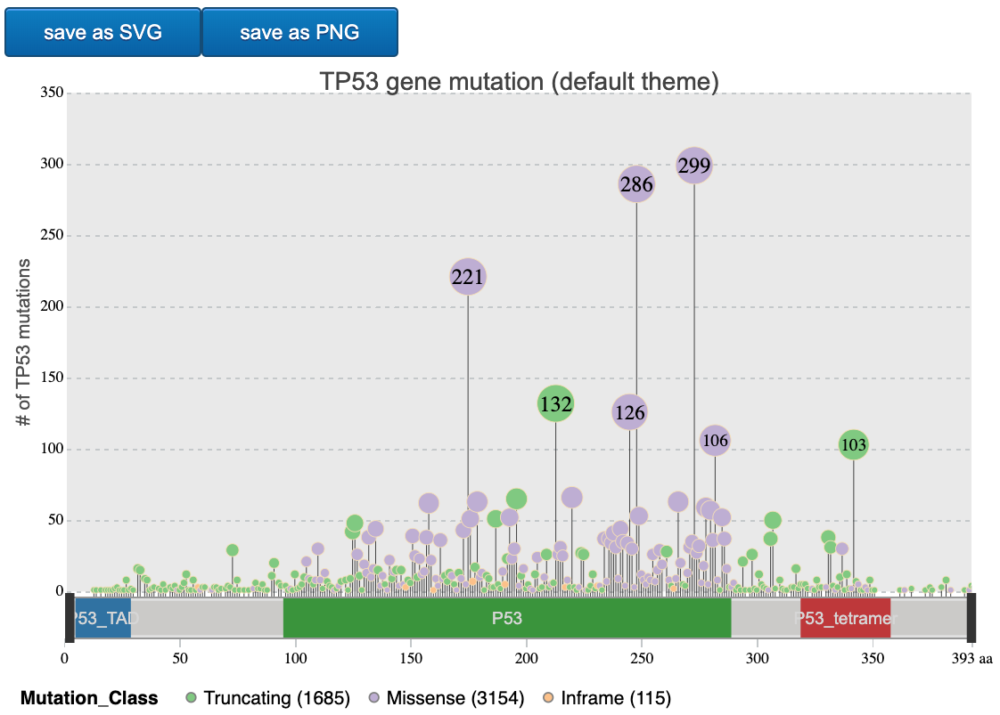
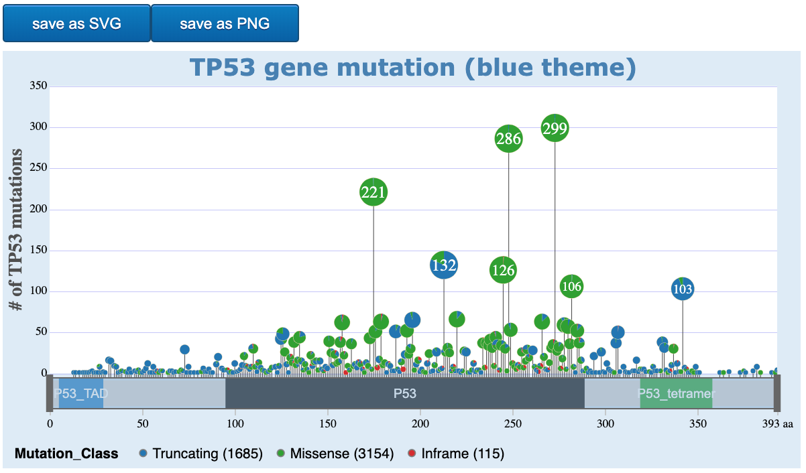
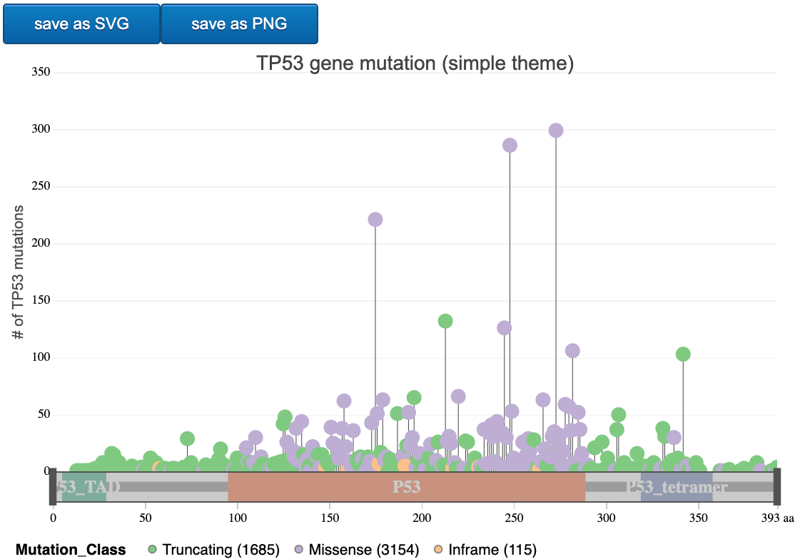
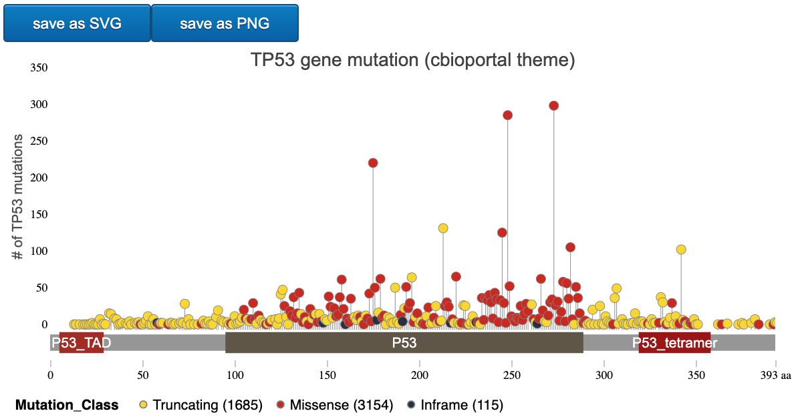
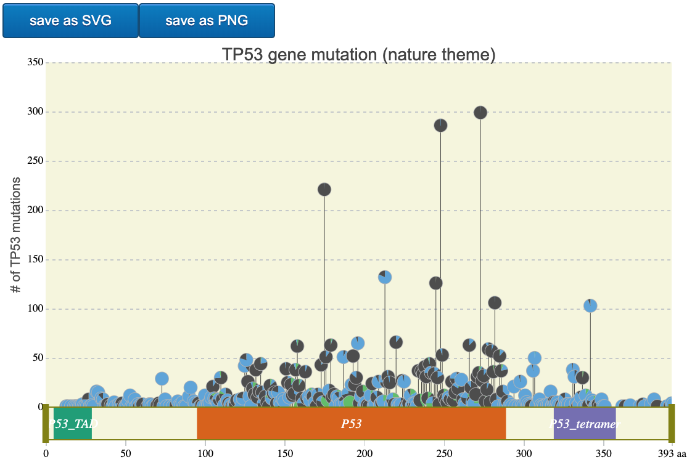
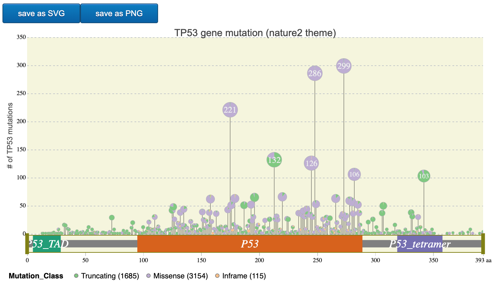
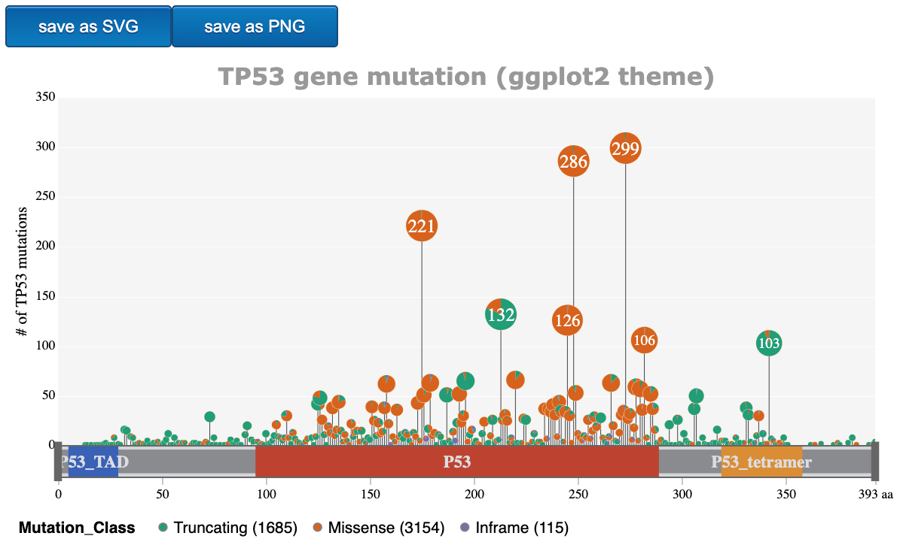
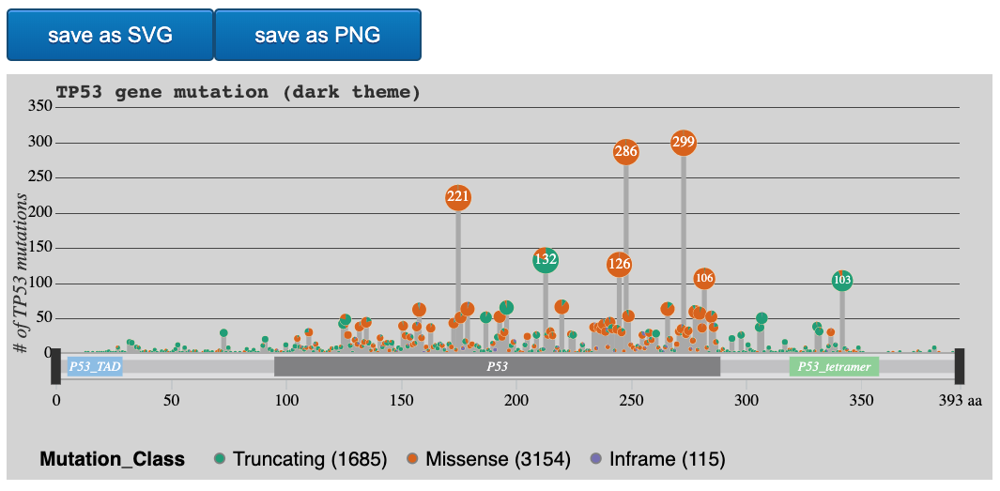

```{r, message=FALSE, include = FALSE}
# install package
library(g3viz)
library(cgdsr)
library(knitr)
```


```{r setup, include = FALSE}
knitr::opts_chunk$set(
	echo = TRUE,
	collapse = TRUE,
	comment = "#>"
)
```

The `g3viz` package contains 8 ready-to-use chart schemes: *default*, *blue*, *simple*, *cbioportal*, *nature*, *nature2*, *ggplot2*, and *dark*.

* Load data

```r
# Retrieve TP53 mutation data of the MSK-IMPACT study from cBioPortal
mutation.dat <- getMutationsFromCbioportal("msk_impact_2017", "TP53")
#> Found study msk_impact_2017
#> Found mutation data set msk_impact_2017_mutations
#> 10945 cases in this study
```

# *default* theme
```r
g3Lollipop(mutation.dat,
           plot.options = 
             g3Lollipop.theme(theme.name = "default",
                              title.text = "TP53 gene mutation (default theme)",
                              y.axis.label = "# of TP53 mutations",
                              legend.title = "Mutation_Class"),
           btn.style = "blue",
           gene.symbol = "TP53",
           output.filename = "default_theme")
#> Factor is set to Mutation_Class
```

```{r, chunk-label, out.width = "4.6in", fig.align='center', fig.cap='g3viz lollipop-diagram with default theme', echo = FALSE}

```

# *blue* theme
```r
g3Lollipop(mutation.dat,
           plot.options =
             g3Lollipop.theme(theme.name = "blue",
                              title.text = "TP53 gene mutation (blue theme)",
                              y.axis.label = "# of TP53 mutations",
                              legend.title = "Mutation_Class"),
           btn.style = "blue",
           gene.symbol = "TP53",
           output.filename = "blue_theme")
#> Factor is set to Mutation_Class
```

```{r, chunk-label2, out.width = "4.6in", fig.align='center', fig.cap='g3viz lollipop-diagram with blue theme', echo = FALSE}

```

# *simple* theme
```r
g3Lollipop(mutation.dat,
           plot.options =
             g3Lollipop.theme(theme.name = "simple",
                              title.text = "TP53 gene mutation (simple theme)",
                              y.axis.label = "# of TP53 mutations",
                              legend.title = "Mutation_Class"),
           btn.style = "blue",
           gene.symbol = "TP53",
           output.filename = "simple_theme")
#> Factor is set to Mutation_Class
```


```{r, chunk-label3, out.width = "4.6in", fig.align='center', fig.cap='g3viz lollipop-diagram with simple theme', echo = FALSE}

```

# *cbioportal* theme
```r
g3Lollipop(mutation.dat,
           plot.options =
             g3Lollipop.theme(theme.name = "cbioportal",
                              title.text = "TP53 gene mutation (cBioPortal theme)",
                              y.axis.label = "# of TP53 mutations",
                              legend.title = "Mutation_Class"),
           btn.style = "blue",
           gene.symbol = "TP53",,
           output.filename = "cbioportal_theme")
#> Factor is set to Mutation_Class
```

```{r, chunk-label4, out.width = "4.6in", fig.align='center', fig.cap='g3viz lollipop-diagram with cBioPortal theme', echo = FALSE}

```


# *nature* theme
```r
g3Lollipop(mutation.dat,
           plot.options =
             g3Lollipop.theme(theme.name = "nature",
                              title.text = "TP53 gene mutation (nature theme)",
                              y.axis.label = "# of TP53 mutations",
                              legend.title = "Mutation_Class"),
           btn.style = "blue",
           gene.symbol = "TP53",
           output.filename = "nature_theme")
#> Factor is set to Mutation_Class
```


```{r, chunk-label5, out.width = "4.6in", fig.align='center', fig.cap='g3viz lollipop-diagram with nature theme', echo = FALSE}

```


# *nature2* theme
```r
g3Lollipop(mutation.dat,
           plot.options =
             g3Lollipop.theme(theme.name = "nature2",
                              title.text = "TP53 gene mutation (nature2 theme)",
                              y.axis.label = "# of TP53 mutations",
                              legend.title = "Mutation_Class"),
           btn.style = "blue",
           gene.symbol = "TP53",
           output.filename = "nature2_theme")
#> Factor is set to Mutation_Class
```


```{r, chunk-label6, out.width = "4.6in", fig.align='center', fig.cap='g3viz lollipop-diagram with nature2 theme', echo = FALSE}

```


# *ggplot2* theme
```r
g3Lollipop(mutation.dat,
           plot.options =
             g3Lollipop.theme(theme.name = "ggplot2",
                              title.text = "TP53 gene mutation (ggplot2 theme)",
                              y.axis.label = "# of TP53 mutations",
                              legend.title = "Mutation_Class"),
           btn.style = "blue",
           gene.symbol = "TP53",
           output.filename = "ggplot2_theme")
#> Factor is set to Mutation_Class
```


```{r, chunk-label7, out.width = "4.6in", fig.align='center', fig.cap='g3viz lollipop-diagram with ggplot2 theme', echo = FALSE}

```


# *dark* theme
```r
g3Lollipop(mutation.dat,
           plot.options =
             g3Lollipop.theme(theme.name = "dark",
                              title.text = "TP53 gene mutation (dark theme)",
                              y.axis.label = "# of TP53 mutations",
                              legend.title = "Mutation_Class"),
           btn.style = "blue",
           gene.symbol = "TP53",
           output.filename = "dark_theme")
#> Factor is set to Mutation_Class
```


```{r, chunk-label8, out.width = "4.6in", fig.align='center', fig.cap='g3viz lollipop-diagram with dark theme', echo = FALSE}

```
